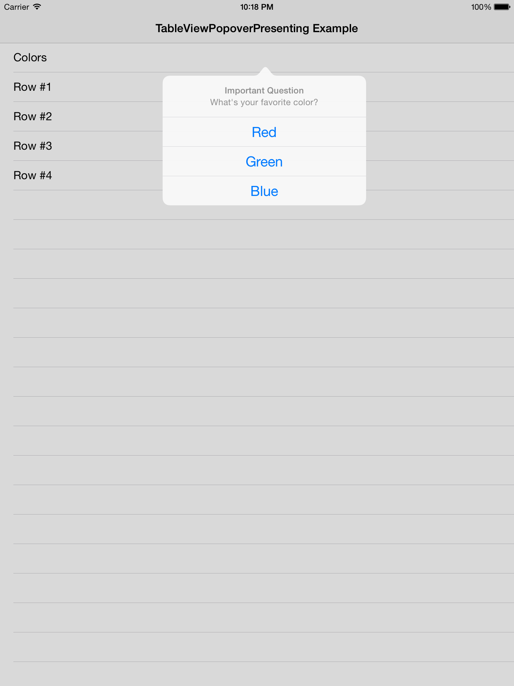

# TableViewPopoverPresenting

[](https://travis-ci.org/Dan Loewenherz/TableViewPopoverPresenting)
[](http://cocoapods.org/pods/TableViewPopoverPresenting)
[](http://cocoapods.org/pods/TableViewPopoverPresenting)
[](http://cocoapods.org/pods/TableViewPopoverPresenting)

TableViewPopoverPresenting is a simple, drop-in protocol that gives your table views the power to display presented view controllers in popovers in reaction to a cell tap. It overrides the standard table view tap handler only for the cells which you define it for, and everything else falls back to your existing `tableView(_:didSelectRowAt:)` implementation.



## Why Does This Exist

In the good ole' days, in order to present popovers over your table view cells, you had to do a few things:

1. Instantiate a `UITapGestureRecognizer`.
2. Add it to your `UITableView`.
3. Make your `UIViewController` conform to `UIGestureRecognizerDelegate`.
4. Create a method to handle the tap.
5. Make sure the tap gesture recognizer doesn't override the standard `UITableView` touch handlers for `tableView(_:didSelectRowAt:)`.
6. Find the point where the user tapped.
7. Retrieve which index path the user tapped corresponding to that point.
8. Make sure that you actually want to show a view controller at that index path.
9. Decide on which view controller to show.
10. And finally, present the view controller exactly where the user tapped in a popover.

Each one of these items requires going through StackOverflow posts with a fine-toothed comb to make sure you're doing everything the "right" way. Obviously, that's lame. You shouldn't need to do all of this work for something which should be simple. And that's where TableViewPopoverPresenting comes in.

## Installation

TableViewPopoverPresenting is available through [CocoaPods](http://cocoapods.org). To install
it, simply add the following line to your Podfile:

```ruby
pod "TableViewPopoverPresenting"
```

## Usage

1. Install TableViewPopoverPresenting through Cocoapods by adding the following line to your Podfile.

   ```ruby
   pod "TableViewPopoverPresenting"
   ```

2. Import `TableViewPopoverPresenting` in the file with your table view controller.

   ```swift
   import TableViewPopoverPresenting
   ```

#### Now, for each view controller, do the following:

1. Call `initializeTableViewPopover` in `viewDidLoad`:

   ```swift
   func viewDidLoad() {
       super.viewDidLoad()

       # ...

       initializeTableViewPopover()

       # ...
   }
   ```

2. Implement `viewControllerForPopoverAtIndexPath` to define which view controllers to show at which index paths. E.g.:

   ```swift
   func viewControllerForPopoverAtIndexPath(indexPath: NSIndexPath) -> UIViewController? {
       if indexPath.row == 0 {
           let actionSheet = UIAlertController(title: "Important Question", message: "What's your favorite color?", preferredStyle: .ActionSheet)
           actionSheet.addAction(UIAlertAction(title: "Red", style: .Default) { _ in })
           actionSheet.addAction(UIAlertAction(title: "Green", style: .Default) { _ in })
           actionSheet.addAction(UIAlertAction(title: "Blue", style: .Default) { _ in })
           return actionSheet
       } else {
           return nil
       }
   }
   ```

And...that's it. You're done. A nice action sheet will appear when a tap is detected on the first row of any section. Easy, right?

## Requirements

None.

## Author

Dan Loewenherz, dan@lionheartsw.com

## License

TableViewPopoverPresenting is available under the Apache 2.0 license. See the [LICENSE](LICENSE) file for more info.

## Donate

Donations help support our open source efforts.

<a href="https://www.coinbase.com/checkouts/0bbaac2f6c0a10f7854c34a0035d0a32" target="_blank">Donate Now</a>
